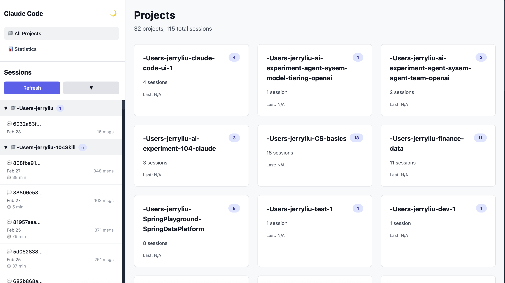
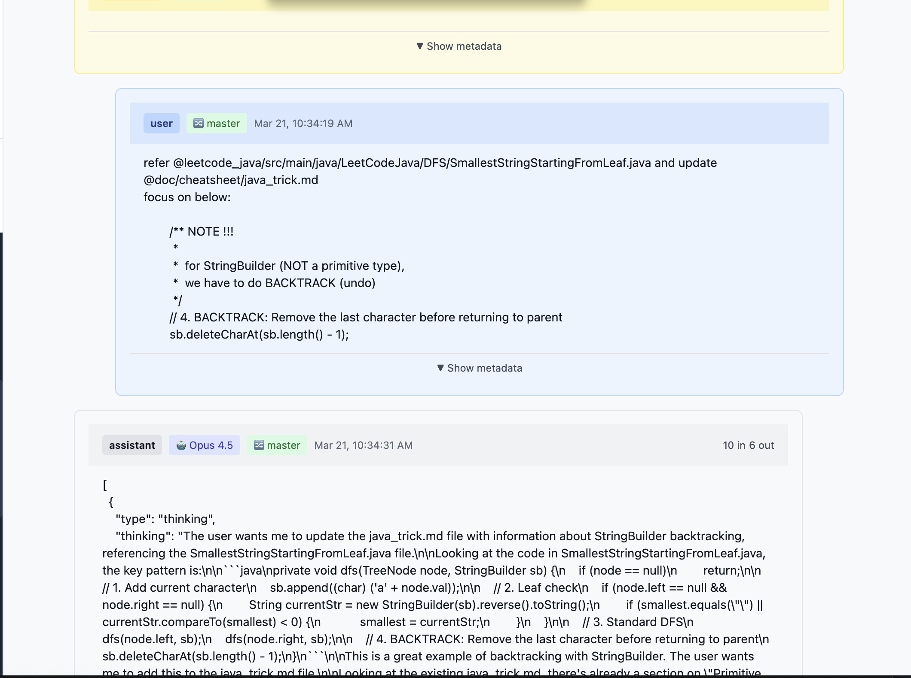

# Claude Code Session Visualizer

A Vue 3 + Tailwind CSS application for visualizing Claude Code session data, including dialogue history, message content, timestamps, and token usage statistics.


<p align="center"></p>

<p align="center"></p>


## Quick Start

### 1. Install Dependencies
```bash
npm install
```

### 2. Start Backend Server (Terminal 1)
```bash
npm run server
```
Runs on `http://localhost:3001`

### 3. Start Frontend Dev Server (Terminal 2)
```bash
npm run dev
```
Opens at `http://localhost:5173`

## Features

✨ **Session Management**
- View all Claude Code sessions from `~/.claude/projects/`
- Sessions grouped by project
- Quick session selection

💬 **Message Viewer**
- Display full conversation history
- Formatted message cards with timestamps
- Token usage per message
- Tool usage details (when applicable)

📊 **Statistics Dashboard**
- Total token usage by model
- Cache hit statistics
- Session analytics
- Daily token tracking

## Project Structure

```
├── src/
│   ├── App.vue                    # Main layout container
│   ├── components/
│   │   ├── SessionList.vue        # Session sidebar
│   │   ├── DialogueViewer.vue     # Message display
│   │   ├── MessageCard.vue        # Individual messages
│   │   ├── StatsOverview.vue      # Statistics panel
│   │   └── StatCard.vue           # Stat display
│   ├── main.js                    # Vue app entry
│   └── style.css                  # Tailwind styles
├── server/
│   ├── index.js                   # Express server
│   └── claudeDataReader.js        # Data utilities
└── index.html                     # HTML entry point
```

## Data Sources

- **Sessions**: `~/.claude/projects/{project}/{sessionId}.jsonl`
- **Statistics**: `~/.claude/stats-cache.json`

## Development

### Build for Production
```bash
npm run build
```

### Preview Production Build
```bash
npm run preview
```

## Technology Stack

- **Vue 3** - Composition API with `<script setup>`
- **Tailwind CSS** - Utility-first styling
- **Vite** - Fast build tool
- **Express** - Backend server
- **Axios** - HTTP client

## Troubleshooting

**"No sessions found"**
- Ensure `~/.claude/projects/` directory exists
- Backend server must be running
- Check browser console for API errors

**Port Conflicts**
- Backend port: Set `PORT` in `.env` or `server/index.js`
- Frontend port: Edit `vite.config.js`

**CORS Issues**
- Verify backend server is running
- Check that frontend is accessing `/api` correctly

## Browser Support

Modern browsers (Chrome, Firefox, Safari, Edge)

## Next Steps

See [SETUP.md](./SETUP.md) for detailed setup instructions and configuration options.

## Future Enhancements

- Real-time session updates
- Export sessions as markdown/HTML
- Message search and filtering
- Token usage charts and trends
- Dark mode support
- Message type filtering
